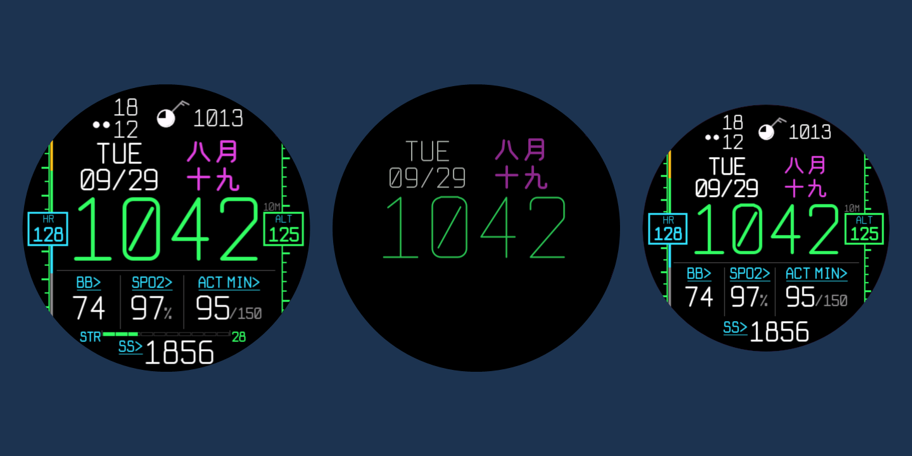
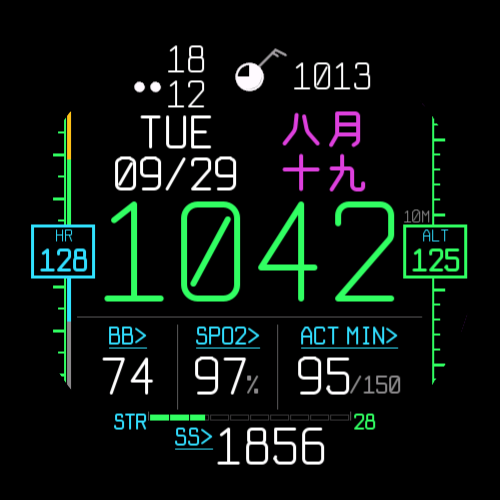
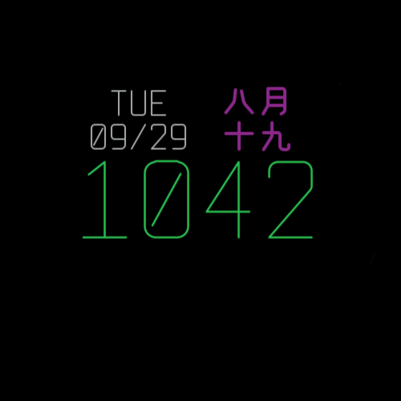
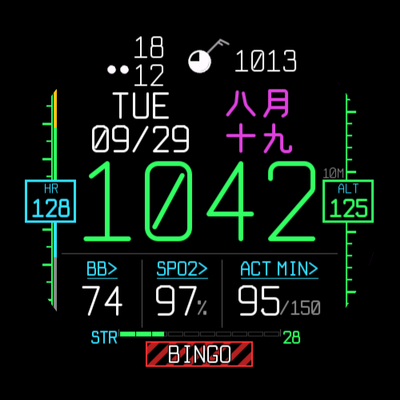
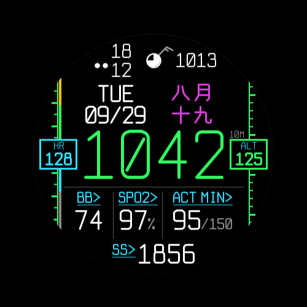

# PCD Cockpit — Connect IQ watch face

F-35 PCD / HUD style watch face for the fēnix 8 47mm AMOLED (`fenix847mm`) and Venu 3S (`venu3s`), plus other 454 px round AMOLED watches that share the fēnix layout and fonts: fēnix 8 Pro, Forerunner 965 / 970, Venu 3, Venu 4 45mm, epix Pro 51mm (requirements §1).



| fēnix 8 | Always-on | BINGO warning | Venu 3S |
|---|---|---|---|
|  |  |  |  |

| Document | For |
|---|---|
| [requirements.md](requirements.md) | What the face shows, with every size and position |
| [GUIDE.en.md](GUIDE.en.md) / [GUIDE.md](GUIDE.md) | How to read the face (English / Chinese; kept in sync — any change goes into both) |
| [SETTINGS.md](SETTINGS.md) | Phone settings: what each slot can show, the fields, tests |
| [STORE.md](STORE.md) | Connect IQ Store listing (English / Chinese), submission steps and the store images in `store/` |

## Build

Needs Connect IQ SDK 9.2 (installed via SDK Manager) and a JDK (`C:\Program Files\Java\jdk-27` is used when `java` is not on PATH).

```powershell
.\build.ps1                                  # bin\PcdCockpit-fenix847mm.prg + bin\PcdCockpit-venu3s.prg
.\build.ps1 -Device all                      # a .prg for every product in manifest.xml
.\build.ps1 -Device venu3s -Run              # build and launch in the simulator
.\build.ps1 -Demo -Device fenix847mm -Run    # demo build (see below)
.\build.ps1 -Export                          # bin\PcdCockpit.iq for the Connect IQ Store (release build)
.\build.ps1 -Test                            # unit tests (source\Tests.mc) in the simulator
.\tools\regress.ps1                          # pixel regression against tests\golden\ (about 4 min)
```

**Before committing a change:** run the unit tests and the pixel regression. The regression builds a patched copy in `tests\work\` (fixed data, 10:42, TUE 09/29) and compares the fēnix 8 and Venu 3S captures (everyday / BINGO / amber stress × active / always-on) with `tests\golden\` pixel for pixel. If a change is meant to alter the look, check the diff images in `tests\out\`, then `.\tools\regress.ps1 -Baseline` to accept it.

The signing key defaults to `developer_key` in this folder (git-ignored; `-Key` to override). Keep a backup: store updates must be signed with the same key. To build your own copy, generate a key as described in the [Connect IQ getting-started guide](https://developer.garmin.com/connect-iq/connect-iq-basics/getting-started/).

**Forks:** the app id in `manifest.xml` belongs to the published store version. If you publish your own variant, replace it with a new id (any 32 hex digits) so the two do not collide.

**Sideload:** connect the watch by USB and copy the `.prg` for that device into `GARMIN\APPS\` (the watch shows up as an MTP device in the file explorer). Then select PCD Cockpit as the watch face.

**Fonts:** after changing glyphs, sizes or stroke widths in `tools/FontGen.java`, re-bake the fonts before building (from this folder):

```powershell
java "-Dfile.encoding=UTF-8" tools\FontGen.java [previewDir]
```

It bakes every style in `STYLES` into its own atlases (`<Font>_<tag>.png`) and glyph table (`glyphs_<tag>.json`, with the advances `_adv`). The mockup's original font (`GL` table) is kept in FontGen for reference but not baked.

## Options

Phone settings (store installs only): the font style, what each of the five slots and the gauge show, and the progress bars — see [SETTINGS.md](SETTINGS.md).

Compile-time constants (not settings):

| Option | Where | Default | Does |
|---|---|---|---|
| `GAUGE` | `Layout.mc` | on | Gauge row above the bottom row, 454 px layout only (the bottom row moves down to make room) |

## Demo build (simulator testing)

`-Demo` compiles in `(:demo)` code (via `demo.jungle`) that replaces sensor data every 3 s. It cycles through all 54 weather conditions, both sky-cover paths (cloudCover and fallback), wind directions and speeds (calm to 65 kt), HR zones, altitude, the BINGO warning, stale and missing weather, and switches between active and always-on every 15 s (ignoring the simulator's sleep state). Normal builds exclude it (`(:live)` stubs; `:release` is a built-in annotation, so it cannot be used). The demo build writes the same `bin\PcdCockpit-<device>.prg`, so run a normal `.\build.ps1` again before sideloading.

Simulator tools:

| Script | Does |
|---|---|
| `tools\capture.ps1 -Out x.png` | Screenshots the simulator window, even when covered or minimised |
| `tools\crop.ps1` | Crops a capture and upscales it (nearest neighbour) for pixel inspection |
| `tools\sheet.ps1` | Tiles a series of captures into one image |
| `tools\litpct.ps1` | Measures the lit-pixel percentage in always-on mode |
| `tools\storeassets.ps1` | Remakes the store screenshots, icons and hero in `store\` from fixed-data simulator frames ([STORE.md](STORE.md)) |
| `tools\regress.ps1` | Pixel regression against `tests\golden\`; `-Baseline` rewrites it; `-Show <5 field ids> [-Bars] [-Wide]` captures chosen fields for a look |

To load a new build into a running simulator, stop the previous `build.ps1 -Run` / `monkeydo` first; a second `monkeydo` does not replace the running app.

## Source layout

| File | Contents |
|---|---|
| `source/PcdView.mc` | Draws the face: station model, date block, time, tapes, slots, warning box, always-on mode |
| `source/Layout.mc` | Every size and position per device, and the slot list (`slots`) |
| `source/Slots.mc` | `Slot`: a place that shows one field — style (narrow / wide cell, row, gauge), position, tap rectangle |
| `source/Fields.mc` | What a slot can show: header (and short form), value / unit / progress / shorter forms, gauge label / 0–100 value / status colour, tap target per field |
| `source/Settings.mc` | Phone settings: reads the properties with fallbacks to the defaults, which fields each slot takes |
| `source/Tests.mc` | Unit tests (`.\build.ps1 -Test`; not in watch builds) |
| `resources/settings/` | Phone settings: `properties.xml` (keys, defaults), `settings.xml` (the form) |
| `source/PcdDelegate.mc` | Tap targets → `Complications.exitTo` (slots from `Layout.slots`, tapes, station model) |
| `source/Data.mc` | Sensor, weather and sun-event snapshot (slow values once a minute), warning level, demo data |
| `source/Wx.mc` | Weather mapping (requirements §6), sky circle, wind barb, present-weather symbols |
| `source/Gfx.mc` | Colours (`Col`), line / polygon helpers, `StrokeFont` + `Stroke` text layout over the glyph atlases |
| `source/Lunar.mc` | 1900–2100 lunar table and formatter (2026 / 2027 corrected to the official calendar) |
| `resources-<device>/` | Launcher icon (fēnix 8 47mm and Venu 3S; the other 454 px watches use the fēnix folder via `monkey.jungle`, and the compiler scales the icon for the Venu 3 and epix Pro) |
| `resources-<device>/fonts/` | Generated by FontGen (do not edit): PNG atlases per font and style, `glyphs_<style>.json`, `fonts.xml` |
| `tools/FontGen.java` | Bakes the glyph atlases from the F-35-style vector glyphs (`GL2`) and the CJK skeletons |

## Implementation notes

- **Text** uses single-line vector glyphs (`GL2` table, shaped after the F-35 PCD font) plus 17 CJK stroke glyphs, baked by `tools/FontGen.java` into one white PNG atlas per size, weight and style. On the watch each character is cropped from the atlas with `dc.drawBitmap2`, recoloured with `:tintColor` and placed with monospaced advances rounded to whole pixels.
  - Why not Connect IQ fonts: they reduce anti-aliasing to about 4 alpha levels, which made thin strokes look jagged. PNG bitmaps with `packingFormat="png"`, no dithering and no automatic palette keep full alpha.
  - Why not live vector drawing: integer pens, bumps at joints, and the per-vertex work tripped the watchdog ("Code Executed Too Long").
  - Hinting: stroke widths are rounded to whole pixels, vertical and horizontal stems are snapped to the pixel grid (odd widths on a .5 centre), and the other points are interpolated between the snapped stems, so small digits and curves such as `S` stay crisp. Always-on fonts keep their exact fractional width.
- **Tapes:** straight vertical tapes at 9 and 3 o'clock. They were arcs at 10 and 2 o'clock; moving them down beside the time fixed the top-heavy look and freed width for a larger date. The value box sits against the bezel with no pointer (its centre is the current value); the spine runs behind it as a pixel-aligned 2 px rectangle, up and down to the bezel (drawn a little past it; the round display cuts it off). Ticks (pointing outward) and HR zone bands (inner side) are pixel-aligned rectangles: anti-aliased 2.2 px ticks at fractional y looked 2 or 3 px thick depending on where they sat, so they are snapped to whole pixels (major ticks 3 px, minor 2 px) and scroll in 1 px steps. The heart-rate tape has a tick every 5 bpm at 22 / 19 px (about ±30 bpm visible; 2 bpm ticks at 9 px were tried and looked too dense), the altitude tape one every 20 m at 15 / 13 px. The box's black fill covers the middle. (The arcs used `dc.drawArc`, which rounds to whole degrees: a zone sliver under 1° once rounded to start = end and drew a full gray ring around the screen. The rectangles have no such case.)
- **Slots:** the data row cells, the date block's right column and the bottom row are all `Slot`s in one list (`Layout.slots`). `PcdView.drawSlots` draws them by style and `PcdDelegate` hit-tests the same list, so a slot's tap always matches what it shows. Adding a field only touches `Fields.mc`. The refactor to slots was checked pixel for pixel against the previous build (frozen demo frames, both watches, active, always-on, BINGO, STRESS and a field in the date block: no differing pixel).
- **Gauge** (454 px layout): a `GAUGE` slot, so it draws and taps like the others; the field comes from `Field.gauge`, which gives the label, a 0–100 value and a status colour, so another 0–100 field (sleep score, say) only needs a case there. Segments are pixel-aligned rectangles and the last one fills in proportion, so the bar moves about 2 px per point.
- **BINGO** (battery ≤ 10%) replaces the bottom row: a square box with a 2 px red border, dimmed 45° hazard stripes clipped to the box, and a white label with a 1 px black halo. The JOKER warning from the first spec and the STRESS warnings (0.1.0) were removed; stress shows in the gauge.
- **Lunar table** was generated from the ICU Chinese calendar and checked against it for every day from 1900-01-01 to 2100-12-31 (73,414 days, no mismatches). Day 30 is written 三十. ICU can differ from the official calendar when a new moon falls minutes before midnight Beijing time: 2027's Spring Festival is 02-06, not ICU's 02-07, so the 2026 / 2027 entries are corrected by hand (unit test `testLunarDates`). Other such years have not been checked.
- **Units are fixed:** temperature is always °C whatever the watch setting, pressure always hPa, altitude always metres.
- **Sun events** use the weather observation location, then the activity location, then the last known location (saved in app storage).
- **Always-on** shows only the time (thin strokes), the date and the lunar date. For burn-in, the layer jumps 3–5 px in x and in y every minute (x cycles every 7 minutes, y every 5), more than the widest always-on stroke.

## Verified

| What | Result | When |
|---|---|---|
| Taps / `Complications.exitTo` on the real watch | All targets open their page, current layout (gauge and moved bottom row included) | 2026-09-29 |
| 24-hour burn-in simulation (View > View Screen Heat Map) | fēnix 8, current layout: no burn-in, peak luminance 1.5% (was 1.41% with the previous layout) | 2026-09-28 |
| | Venu 3S, previous layout: no burn-in, peak 1.6% — not re-run for the current layout | 2026-09-27 |
| Always-on lit pixels, one frame (`tools\litpct.ps1`) | 4.2% (fēnix), 4.2% (Venu) | 2026-09-28, current layout |
| Slot refactor | Pixel-identical to the build before it | 2026-09-28 |
| Other 454 px watches (fēnix 8 Pro, FR 965 / 970, Venu 3, Venu 4 45mm, epix Pro 51mm) | Active and always-on render like the fēnix 8 47mm in the simulator (about 45 of 124 kB); not tried on real watches | 2026-09-28 |

## License

[GPL-3.0](LICENSE). You may use, change and redistribute this watch face, including in the Connect IQ Store, as long as what you distribute is also released under the GPL-3.0 with its source.

This is an independent hobby project. "F-35" only describes the visual style; the project is not affiliated with or endorsed by Lockheed Martin, the U.S. Department of Defense or Garmin.
